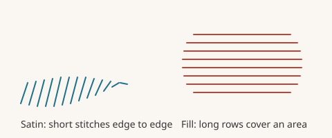

# Run stitches versus fills

Every shape you draw is sewn one of two ways.

- A **run** follows a line. Think of drawing with a pen. It can be a thin single line, a thick satin ribbon or a twisted rope.
- A **fill** covers an area. Think of colouring in with a marker.

## Which one should I use?

| You want | Use |
| --- | --- |
| A thin outline or a stem | Run, **Single** or **Triple** |
| A bold border or a letter stroke | Run, **Satin** |
| A big area like a leaf or a badge face | Fill |
| A textured area like a brick wall | Fill with a motif pattern |

## Switching a shape

A closed shape can be either. In the left panel, **Style** has two buttons: **Filled** sews the whole area, **Outlined** sews only the edge using any run type. The shape bar's **Outline** and **Fill** button does the same.

## What is the difference in sewing?

A run is quick and light. A fill is slower and uses many more stitches. A fill of a 40 by 30 mm area can take thousands of stitches. A satin column of the same length uses far fewer.

## Which settings go with which?

- Runs have a **run type**. Read [Run types](run-types.md).
- Satin runs and satin blocks have **density**, **pull compensation** and **underlay**. Read [Satin tips](satin-tips.md).
- Fills have a **pattern**, **row spacing** and their own underlay. Read [All fill patterns](fill-patterns.md) and [Underlay and pull compensation](underlay-and-pull.md).
