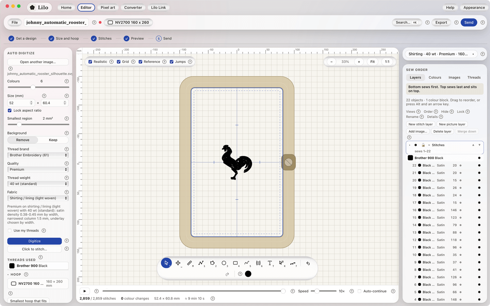

# The screen at a glance

The editor has the same layout every time. Here is where things live.

## Top of the window

- **Views** (Home, Editor, Pixel art, Converter, Lilo Link) switch between the parts of the app. **Help** opens this guide.
- The **top bar** holds the project menu, the project name, the **hoop** chooser, a search box (**⌘K**), **Export** and **Send**.
- The **workflow strip** shows your five steps. Read [Helpers inside Lilo](learning-aids.md).

## Left panel

This panel changes with what you have selected.

- **Nothing selected:** **Auto-digitize** settings and the hoop.
- **A shape selected:** its size, colour, stitch type and fill settings.
- **Text tool or a word selected:** the lettering panel.
- **Click to stitch tool:** the regions panel.

## The canvas

The big middle area. It shows your hoop, a grid and your design. Zoom with scroll or pinch. Pan by holding **Space** and dragging. The small checkboxes in the corner switch the **Realistic**, **Grid**, **Reference** and **Jumps** views.

When you select a shape, a small **shape bar** floats above it with actions like **Reshape**, **Cut hole**, **Knife** and **Duplicate**.

## The toolbar

The floating bar at the bottom holds the drawing tools, **Undo**, **Redo** and your **drawing colour**. Read [Drawing tools](drawing-tools.md).

## The stitch player

Under the canvas. **Play**, scrub and change the speed. It also shows the totals: stitches, size, colour changes and sewing time. Read [The stitch player](stitch-player.md).

## Right column

- **Sewing setup:** fabric, thread weight and quality. Read [Sewing setup](sewing-setup.md).
- **Sew order:** the layers, in the order they are sewn (bottom first). It has tabs for layers, colours, images and your threads. Read [Layers and sew order](layers.md).

## The warnings tray

When Lilo spots something that may sew badly, a small tray appears in the right-hand column, under the Sewing setup card. It is calm and never blocks you. Read [What the warnings mean](warnings-explained.md).
