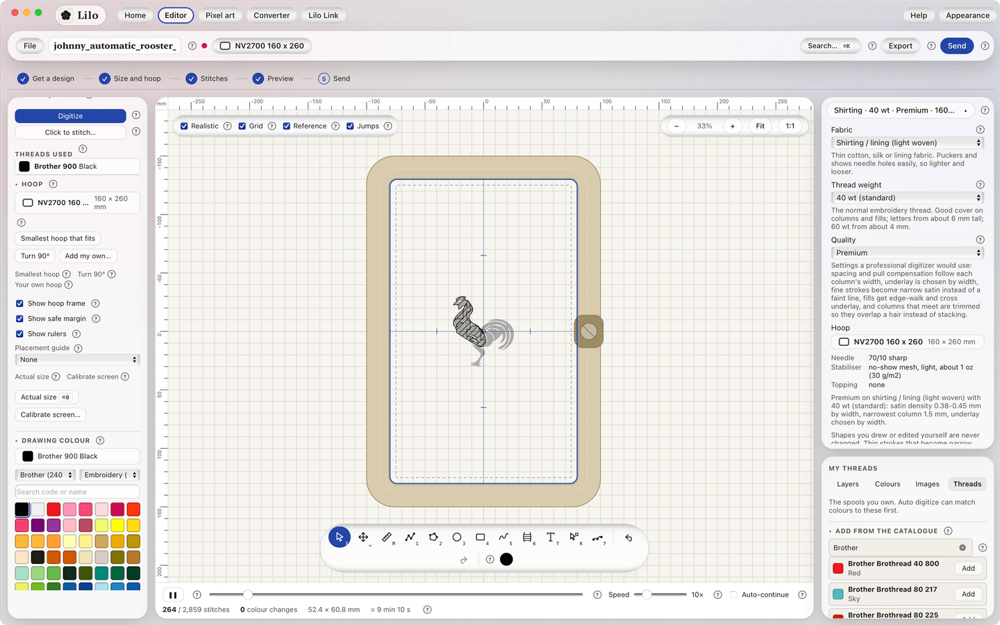

# Sewing setup

The **Sewing setup** card sits at the top of the right column. Its chip shows your current choice, like "Suiting, 40 wt, Standard". Click the chip to open it.

## Three choices

- **Fabric:** what you are sewing on. Suiting, shirting or lining, twill or caps, knit, denim, towel or leather.
- **Thread weight:** **40 wt** is standard. **60 wt** is fine, for small crisp detail.
- **Quality:** **Standard** or **Premium**. Read [Standard or Premium](standard-vs-premium.md).

Changing any of them updates the stitches Lilo made. Anything you edited by hand stays as you left it. One undo step reverses it.

## What the card also shows

The card lists what the setup calls for: needle, stabiliser, topping and hooping tips. The same list appears as **Before you sew** in the Export and Send windows, so you see it before you hit the machine.

## Stitch safety and speed

**Before you sew** also has a **Stitch safety** card and a suggested machine speed. Green means the setting sews well. Amber is a heads up, and the file still exports. Read [Stitch safety and machine speed](stitch-safety.md).

## Why it matters

A design for a thin suit lining sewn on a towel will sink and look thin. A design tuned for towel sewn on lining will pucker. The setup keeps the numbers matched to the cloth.

For a suit-lining monogram, choose **Shirting / lining**, **60 wt** if the letters are under 6 mm, and **Premium**.

## Every setup in detail

Read [Sewing setup presets](sewing-presets.md) for the full list of needles, stabilisers and tips for each fabric.

## It is a starting point

All numbers come from digitizing practice, not from a machine maker's rulebook. Always sew a test on scrap cloth first.
