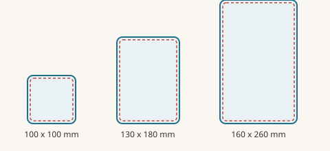
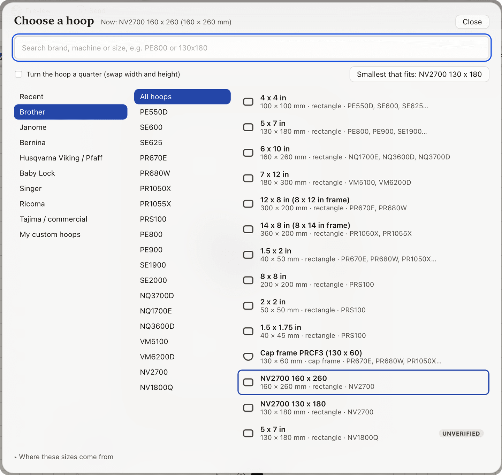

# Sizing and hoops

A design has to fit inside the **sewing area** of the hoop. This page shows how to set the size and pick the hoop.

## Set the size

Select a shape (or **⌘A** for everything) and open **Dimensions** in the left panel.

- Type a **Width** or **Height** in millimetres. Switch to inches with the **Units** buttons.
- **Keep aspect ratio** (the padlock) changes width and height together so the shape does not squash. Turn it off to stretch one side.
- Use **Flip left-right**, **Flip top-bottom** and **Rotate 90°** under the size boxes.

The top-left corner stays put when you resize.

Nothing selected? **Auto-digitize** has its own width and height boxes. They set the size of the next result.

## Choose a hoop

The **hoop chip** in the top bar and in the **Hoop** section shows the current hoop. Click it to open the picker.

- Search by **brand**, **machine** or hoop name.
- Recently used hoops come first.
- **Smallest hoop that fits** picks the smallest hoop that holds your design.
- **Swap width and height** rotates the hoop between landscape and portrait.
- **Add my own…** saves a custom hoop with your own width and height.

Lilo ships a library of real hoops. Where a size could not be confirmed it says so. Check the numbers against your own hoop.

## What the frame shows

- The **hoop frame** and its clamp are drawn around the sewing area.
- The **safe margin** is a dashed line 5 mm inside the sewing area. Stitches close to the edge can hit the hoop.
- **Rulers** run along the top and left. Drag from a ruler to pull out a guide line.
- **Placement guides** show where a design usually goes: a left chest, a pocket, the centre of a hat. Pick one from the list.

## See it at real size

**Actual size** (**⌘0**) shows the design at its true size on your screen. Use **Calibrate screen…** once. You hold a ruler to the screen and Lilo learns how big a millimetre is on your display.

## Fitting a design that is too big

If the design sticks out, Lilo shows a warning in the tray. Pick a larger hoop or scale the design down. Do not squeeze a dense design into a small size without checking density. Read [What the warnings mean](warnings-explained.md).
