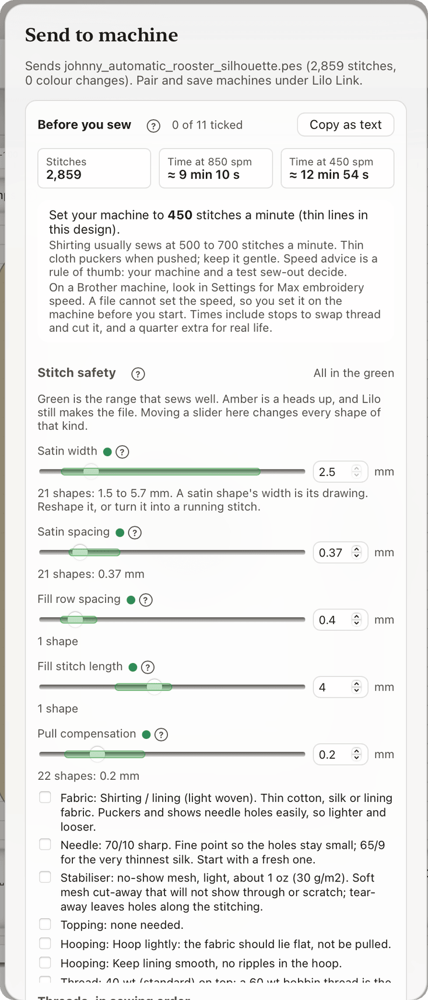

# Stitch safety and machine speed

Some stitch settings sew well. Some make thread break or cloth pucker. Lilo shows you which is which, with a **green band** behind each slider.

Amber is a heads up. It is never a block. Lilo still makes the file and you can still export it.

## Where you see it

- **Before you sew:** open Export or Send and scroll to **Stitch safety**. It has one row for each setting your design uses.
- **On a shape:** select it. The sliders for spacing, stitch length, width and pull compensation carry the same green band.

Inside the green, the dot is green. Outside it, the dot and the box turn amber and one short sentence says why. For example, a satin spacing of 0.30 mm says: "Too tight. The fabric puckers and the thread can break."

## Change many shapes at once

A slider in the **Stitch safety** card changes every shape of that kind. One undo puts them all back.

A satin shape's width is its drawing, so the card cannot widen it. Reshape it, or turn it into a running stitch.

## What will this change?

Under a slider you see how the change moved the design, like "+1,240 stitches · +1 min 30 s". It counts from where you started moving that slider. Lilo works it out in the background, so the screen stays smooth.

## The ranges

These are for 40 wt thread on cloth you wear. 60 wt and towel move a few numbers, noted below.

| Setting | Green range | Where the numbers come from |
| --- | --- | --- |
| Satin width | 1.5 to 10 mm (60 wt: 1 to 10) | Lilo default. The 1.5 mm floor matches the calibration table. |
| Satin spacing | 0.35 to 0.60 mm (60 wt: from 0.30, towel: to 0.70) | Researched |
| Fill row spacing | 0.35 to 0.60 mm (60 wt: from 0.30) | Researched |
| Fill stitch length | 3 to 4.5 mm | Researched |
| Running stitch length | 1.5 to 4 mm (towel: to 5) | Lilo default |
| Pull compensation | 0.1 to 0.4 mm | Lilo default |
| Longest stitch | up to 7 mm on cloth you wear | Researched |

**Researched** means it comes from the sourced calibration table behind Lilo's defaults and from Brother and digitizing guides. **Lilo default** means it is Lilo's own choice, with no source behind it. Treat those as a good start, not a rule.

## Amber notes, in plain words

- **Satin too thin:** the column is narrower than the thread can cover. It will not look shiny. Use a running stitch, or switch to 60 wt thread.
- **Spacing too tight:** the cloth puckers and the thread can break.
- **Spacing too loose:** gaps. The cloth shows through.
- **Fill stitch too short:** the fill goes stiff and sews slowly.
- **Fill or running stitch too long:** it can snag on fingers and buttons.
- **Pull compensation too low:** edges may leave gaps. **Too high:** shapes come out fat.

Lilo also warns when a stitch is over 7 mm on cloth you wear. It still splits anything over 12.1 mm on its own. See [What the warnings mean](warnings-explained.md).

## Lilo's own settings are always green

A design made only with Lilo's settings, for any quality, thread weight and fabric, has no amber items. To keep it that way Lilo:

- splits satin columns wider than 6.8 mm into halves, so no stitch passes 7 mm,
- swaps a zig-zag underlay for edge and centre walks under columns that are wider than 5.5 mm,
- keeps satin columns at 1.5 mm or wider with 40 wt thread (1 mm with 60 wt) and sews thinner strokes as a running stitch,
- keeps satin spacing at or above 0.35 mm with 40 wt thread.

The "too dense" warning now ignores a single 1 mm spot where two lines cross. That is normal. It still warns when thread piles up over two or more touching spots, or twice the limit in one spot.

## Letters and thin lines

With 40 wt thread and Premium quality, custom-font letters now never use a satin column under 1.5 mm. Thinner strokes become a running stitch. A 1 mm column is too thin to look shiny, and it breaks thread. 60 wt thread still allows 1 mm.

## Machine speed

A file cannot set your machine's speed. You set it on the machine. Lilo suggests a speed for the design in **Before you sew**:

> Set your machine to **450** stitches a minute (thin lines in this design).

Lilo starts from the middle of the range for your fabric, then slows down for what is in the design.

| What is in the design | Suggested speed |
| --- | --- |
| Satin columns under 2 mm, or letters under 5 mm tall | 450 |
| Metallic thread | 400 |
| Very dense stitching | 550 |
| Leather, towel, denim | Their own slower range |

It never goes above the machine's top speed, 850 stitches a minute on the Brother NV2700. The caps are rules of thumb from Brother's FAQ and hobbyist guides. No maker publishes an exact table, so sew a test first.

On a Brother machine, look in Settings for **Max embroidery speed**. Menu names differ between models, so Lilo does not give exact steps.

## Sew time

**Before you sew** shows the time at 850 stitches a minute and the time at the suggested speed. The time counts:

- the stitches at that speed,
- 7 seconds for each thread cut,
- 45 seconds for each colour change,
- and a quarter extra for real life: checking, re-threading and the odd thread break.

The estimate is a guide. Your machine and your cloth decide.
