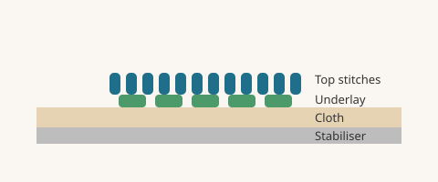
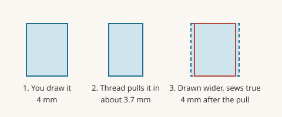

# Underlay and pull compensation

## Underlay

**Underlay** is the layer of light stitches sewn before the visible ones. Read the idea first in [Stitch terms](basics-stitch-terms.md).

### Satin underlay choices

Pick one from the **Underlay** list in the **Satin** section.

| Choice | What it is | Use for |
| --- | --- | --- |
| None | No underlay | Very thin columns, or when you add your own |
| Center run | One line down the middle | Columns under about 2.5 mm |
| Contour | A line right inside each edge | Medium columns |
| Zig-zag | Back-and-forth across the column | Wider columns |
| Contour + zig-zag | Edge walk plus zig-zag | Wide columns on soft cloth |
| Center + contour | Middle line plus edge walk | Columns of about 2.5 to 4 mm |
| Double zig-zag | Two zig-zag passes | Columns wider than about 6 mm |

When Lilo digitizes for you it picks one by width: centre run under 2.5 mm, centre plus edge up to 4 mm, edge plus zig-zag up to 6 mm, and double zig-zag beyond that. You can change it.

### Fill underlay

In the **Underlay** section of a fill:

- The **Underlay** switch adds one light pass at right angles to the fill.
- **Customise underlays…** lets you add several passes. Each has an **Angle**, **Spacing**, **Length** and **Inset**. **Inset** is how far inside the edge the underlay stops, so it stays hidden.
- Open patterns (motifs, crosshatch) skip the automatic underlay, because it would show through the gaps.

Heavy fills on soft cloth benefit from two passes at different angles.

## Pull compensation

Thread pulls cloth inward, so stitched shapes come out smaller than you drew. **Pull compensation** makes the shape a little bigger on purpose.

- **Satin columns:** widens each side. 0.15 mm per side is the Standard starting value. Premium uses 0.20 mm. The slider goes up to 0.8 mm.
- **Fills:** grows the shape. The slider goes up to 1 mm.

Stretchy cloth pulls more. Lilo's Sewing setup raises compensation for knits to about 1.8 times the woven value.

### How to tell if you need more

Sew a test. If a 4 mm column measures 3.7 mm, or if the outline of a fill sits inside its border, raise pull compensation. If it looks fatter than your drawing or it overlaps its neighbours, lower it.

## Related

- [Satin tips](satin-tips.md)
- [Sewing setup](sewing-setup.md)
- [Fixing sew-out problems](sewout-troubleshooting.md)
